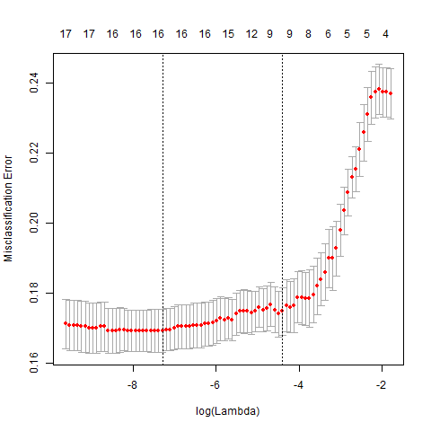
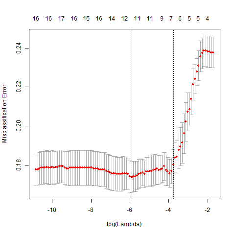
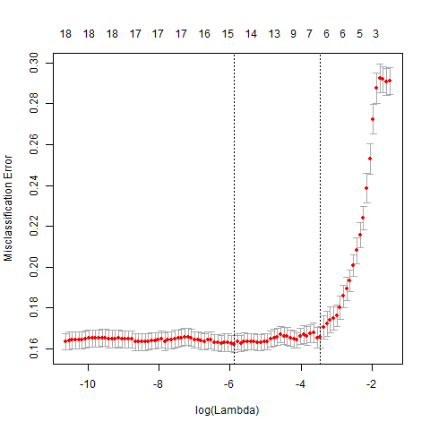
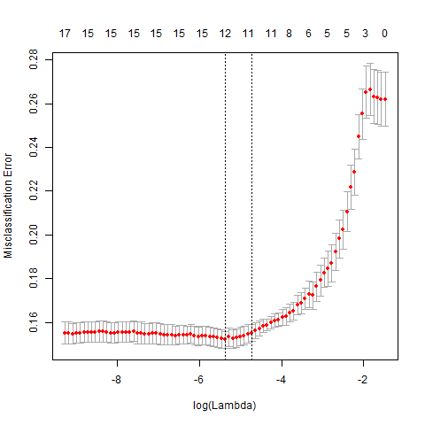
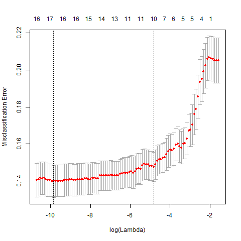
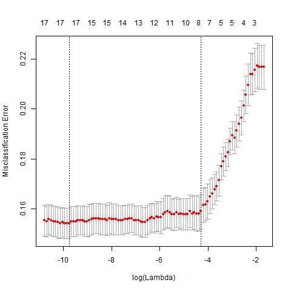
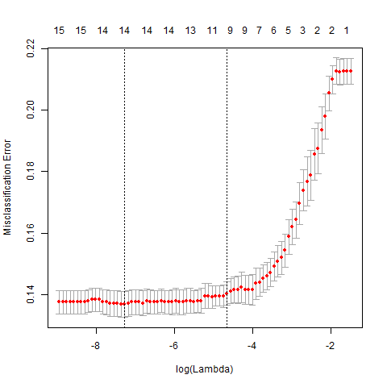

```{r setup, include=FALSE}
knitr::opts_chunk$set(echo = TRUE)
library(here)
library(foreign)
library(tidyverse)
library(glmnet)
sig_coefs <- read_csv(here("docs", "output", "sig_coefs_all_demos_02_27_2019.csv"))
vars <- as.data.frame(sig_coefs$vars)
```

## Purpose
Predicting the probability of any demolition within a hexagon in a given year, given the overall attributes of the hexagon's parcels/structures in the previous year. The outcome is binary, 1/0, if any/no demolitions. 

Lasso regression adds a penalty term to the estimator (MLE in this case) that biases regression coefficients towards 0. The trade offs for introducing bias to a model is a simpler model (i.e., fewer predictors) with less variance. 

### Predictors 
Eighteen variables aggregated to the 1000-foot hexagon level were selected to predict demolition. They take the form of counts, averages, or proportions. 
```{r predictors, echo=FALSE} 

print(vars)

```


### Model Fit
These plots show the prediction accuracy of the model as the strength of the penalty term changes. Reading from right to left, the first red dot is the misclassification rate for the null model: when the penalty term is so strong that all the coefficients are pushed to zero. 

 

### Misclassification Rates by Year {.tabset}
#### 2011



#### 2012



#### 2013



#### 2014



#### 2015



#### 2016



#### 2017



### Key predictors of demolition by year
This table shows the nonzero coefficients for the most regularized model (i.e., the one corresponding to the right dotted vertical line)  for each year.

```{r pressure, echo=FALSE} 
knitr::kable(sig_coefs[-1,])
```
